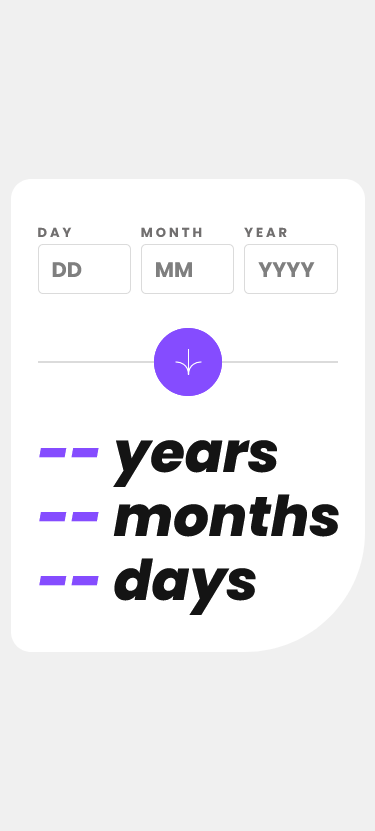
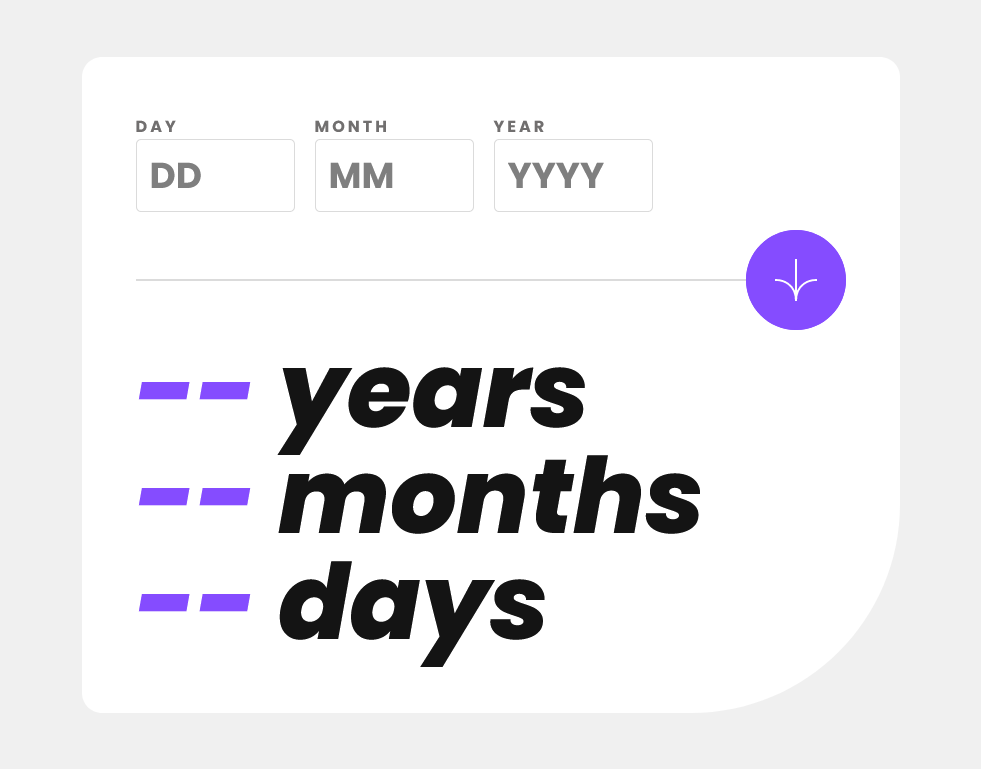

## Overview
This is my solution for front-end mentor challenge name: [Age calculator app](https://www.frontendmentor.io/challenges/age-calculator-app-dF9DFFpj-Q)

### Screenshot
Mobile view\

desktop view\

### Demo
[FireShot](https://wajidkhan2-frontendmentor-challenges.github.io/Age-calculator-app-fm-html-css-js-jquery/)

### Built with
- Mobile-first workflow
- Semantic HTML5 markup
- CSS custom properties
- JS and jquery

### What I learned 
i learned about jquery and i also learned about time.

### Author 
[wajidkhan2](https://github.com/wajidkhan2)
